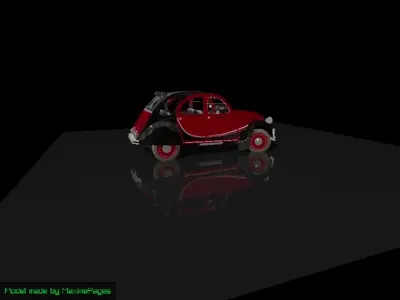
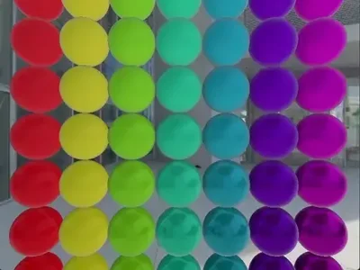

# R3D - 3D Rendering Library for raylib


<br>
R3D is a modern 3D rendering library for <a href="https://www.raylib.com/">raylib</a> that provides advanced lighting, shadows, materials, and post-processing effects without the complexity of building a full engine from scratch.
<br clear="left">

---

## Key Features

- **Hybrid Renderer**: Automatic (or manual) deferred/forward rendering
- **Advanced Materials**: Complete PBR material system (Burley/SchlickGGX)
- **Dynamic Lighting**: Directional, spot, and omni lights with soft shadows
- **Post-Processing**: SSAO, SSR, DoF, bloom, fog, tonemapping, and more
- **Model Loading**: Assimp integration with animations and mesh generation
- **Performance**: Built-in frustum culling, instanced rendering, and more

## Installation

```bash
git clone --recurse-submodules https://github.com/Bigfoot71/r3d
cd r3d
mkdir build && cd build
cmake ..
cmake --build .
```

**Requirements**: raylib 5.5+, Assimp, Python 3.6+, OpenGL 3.3+

## Quick Start

```c
#include <r3d.h>

int main(void)
{
    InitWindow(800, 600, "R3D Example");
    R3D_Init(800, 600, 0);

    // Create scene objects
    R3D_Mesh mesh = R3D_GenMeshSphere(1.0f, 16, 32, true);
    R3D_Material material = R3D_GetDefaultMaterial();
    
    // Setup lighting
    R3D_Light light = R3D_CreateLight(R3D_LIGHT_DIR);
    R3D_SetLightDirection(light, (Vector3){ -1, -1, -1 });
    R3D_SetLightActive(light, true);
    
    // Camera setup
    Camera3D camera = {
        .position = { -3, 3, 3 },
        .target = { 0, 0, 0 },
        .up = { 0, 1, 0 },
        .fovy = 60.0f,
        .projection = CAMERA_PERSPECTIVE
    };

    // Main loop
    while (!WindowShouldClose()) {
        BeginDrawing();
        R3D_Begin(camera);
        R3D_DrawMesh(&mesh, &material, MatrixIdentity());
        R3D_End();
        EndDrawing();
    }

    R3D_UnloadMesh(&mesh);
    R3D_Close();
    CloseWindow();
    return 0;
}
```

## License

Licensed under the **Zlib License** - see [LICENSE](LICENSE) for details.

## Screenshots




